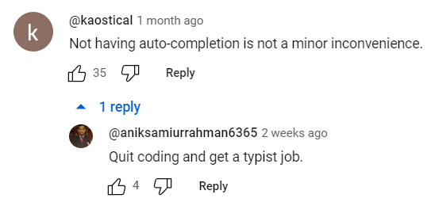

<!--
**KingPsychopath/KingPsychopath** is a ✨ _special_ ✨ repository because its `README.md` (this file) appears on your GitHub profile.

Here are some ideas to get you started:

- 🔭 I’m currently working on ...
- 🌱 I’m currently learning ...
- 👯 I’m looking to collaborate on ...
- 🤔 I’m looking for help with ...
- 💬 Ask me about ...
- 📫 How to reach me: ...
- 😄 Pronouns: ...
- ⚡ Fun fact: ...
-->
## A little bit about me...

```js
let Owen = {
    pronouns: ["He", "Him", "They"],
    lang: ["JavaScript", "Python", "Java", "GO"],
    certs: ["CiSCO CCNA", "AWS Solution Architect...\n"],
    askMeAbout: ["DevOps", "Cinematography", "Software Development", "System Design", "3D Modelling/Rigging", "Accessibility"],
    technologies: {
        frontEnd: {
            js: ["Vanilla", "jQuery"],
            css: ["CSS3"]
            html: ["HTMX"]
        },
        backEnd: {
            python: ["flask"],
            java : ["JSP", "Maven"],
            js: ["node", "express"],
            go: [""]
        },
        env: ["Arch Linux"],
        cicd: ["GitHub Actions", "Jenkins", "Git"],
        databases: ["Postgre", "MySQL", "SQLite", "Redis"],
        devOps: ["AWS", "Terraform", "Docker", "K8s", "Kafka", "Redis"],
        mL: ["Tensorflow", "Keras", "Sklearn", "open-cv", "matplotlib", "pandas"]
    },
    currentProject: "Enhancing my current skillset within DevOps whilst simultaneously looking for new opportunities.",
    joke: "Why was the tomato shy?",
    punchline: "Because it saw the Salad dressing!",
  contact: "Apologies, I prefer to place my contacts directly on my CV for privacy reasons"
};
```
<p align="center">
  
</p>


