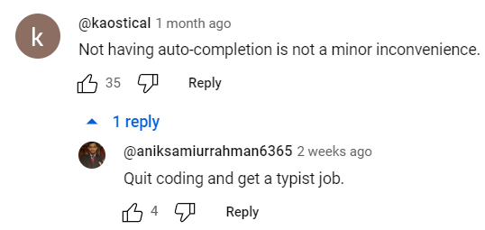

<!--
**KingPsychopath/KingPsychopath** is a ✨ _special_ ✨ repository because its `README.md` (this file) appears on your GitHub profile.

Here are some ideas to get you started:

- 🔭 I’m currently working on ...
- 🌱 I’m currently learning ...
- 👯 I’m looking to collaborate on ...
- 🤔 I’m looking for help with ...
- 💬 Ask me about ...
- 📫 How to reach me: ...
- 😄 Pronouns: ...
- ⚡ Fun fact: ...
-->
## A little bit about me...

```js
const owen = {
  pronouns: ["he/him", "they/them"],

  currentFocus: {
    languages: ["TypeScript", "JavaScript", "SQL"],
    frameworks: ["Next.js", "React", "Tailwind CSS"],
    backend: ["Node.js"],
    dataAndValidation: ["Kysely", "Zod"],
    auth: ["better-auth"],
    testing: ["Vitest", "Testcontainers"],
    databases: ["PostgreSQL", "Redis", "SQLite"],
    cloudAndInfra: ["AWS (S3/EC2/ECS)", "Docker", "Vercel", "Cloudflare (R2)"],
    observability: ["Sentry"],
    analytics: ["PostHog"],
    search: ["Algolia", "Meilisearch"],
    tooling: ["pnpm", "ESLint", "Biome", "Prettier", "GitHub Actions"],
  },

  previousExperience: {
    languages: ["Python", "Java", "Go"],
    frameworks: ["Django", "Wagtail", "JSP"],
    databases: ["MySQL", "MongoDB"],
    infra: ["Terraform", "Kubernetes", "Google Cloud"],
    ml: ["TensorFlow"],
  },

  certifications: ["Cisco CCNA", "AWS Solutions Architect"],

  askMeAbout: ["Rolling my own auth and suffering", "Fete De La Musique", "My Blog"],

  currentProject:
    "Building and shipping three MVPs in parallel, fueled by deadlines and questionable caffeine levels.",

  joke: "Why was the tomato shy?",
  punchline: "Because it saw the salad dressing.",

  contact:
    "Contact details live on my CV. My inbox is invite-only by design.",
};

```
<p align="center">
  
</p>


